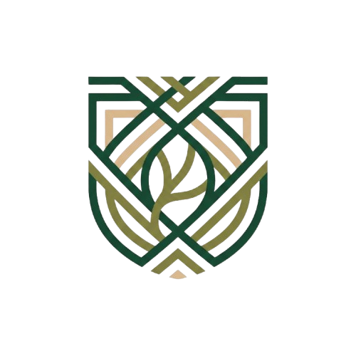
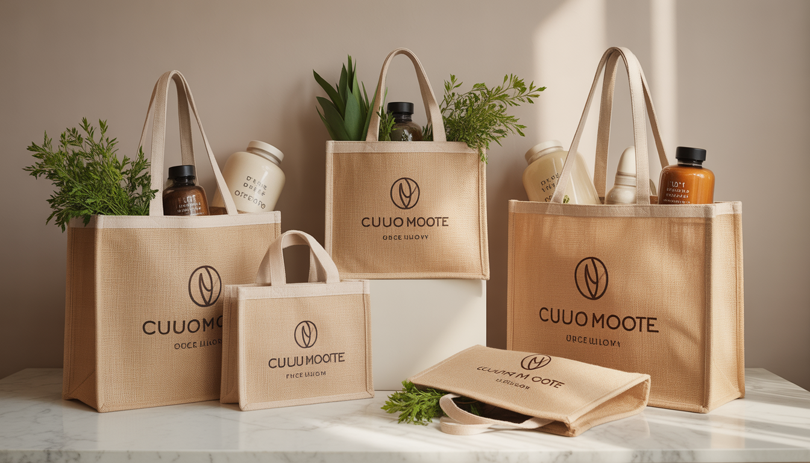

  
  
  # GreenLoom 🌿
  **Sustainable Packaging Solutions | Built with Purpose**
  
  
  
  
  ---

## 🌍 Our Mission
> *"Weaving Sustainability into Brands."*

GreenLoom is a dedicated B2B brand on a mission to completely eliminate single-use plastics from the global supply chain. We provide premium, fully customizable, and environmentally conscious **jute packaging solutions** tailored specifically for modern, eco-conscious businesses.

 

  

 

## 💼 Why Choose GreenLoom?

We believe packaging is the **first physical touchpoint** your customer has with your business. It should reflect your values, elevate your brand, and leave zero negative impact on the planet.

### The GreenLoom Advantage:
* 🌱 **100% Biodegradable & Circular** - Jute enriches soil when decomposed.
* 🛡️ **Carbon Negative** - Our materials absorb more CO₂ than emitted during production.
* 🎨 **Unlimited Customization** - Match your specific pantones, dimensions, and logo placements.
* ⚡ **7-Day Turnaround & 500 MOQ** - Fast, reliable, and accessible for businesses of all sizes.

 

## 🛍️ Our Core Collection
Our curated collection spans every business need—from high-end boutiques to corporate events.

| **Luxury Totes** | **Wine Carriers** | **Corporate Gifts** |
|:---:|:---:|:---:|
| Premium jute with leather handles designed for high-end retail. | Sophisticated structured carriers for premium beverages. | Custom branded bags that amplify event marketing ROI. |

 

## 🤝 Let's Collaborate
GreenLoom is personally founded and operated by **Hannan Ali Mallick**. We partner closely with our clients from the very first mock-up to the final delivery to guarantee perfection.

### Contact the Founder directly:
- **Email:** ✉️ [hannanmallick07@gmail.com](mailto:hannanmallick07@gmail.com)
- **WhatsApp:** 📱 [+91 700371 1453](https://wa.me/917003711453)
- **HQ:** 📍 Kolkata, W.B., India

---

  
If you're interested in partnering to build a more sustainable future, let's talk!

  <b><a href="mailto:hannanmallick07@gmail.com">Request a quote today →</a></b>

